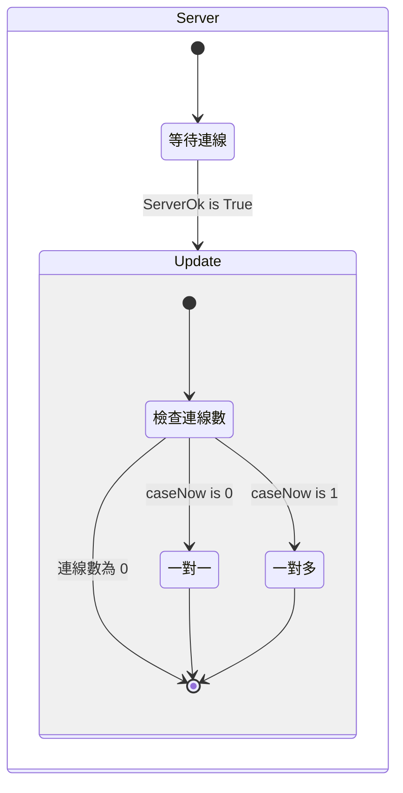
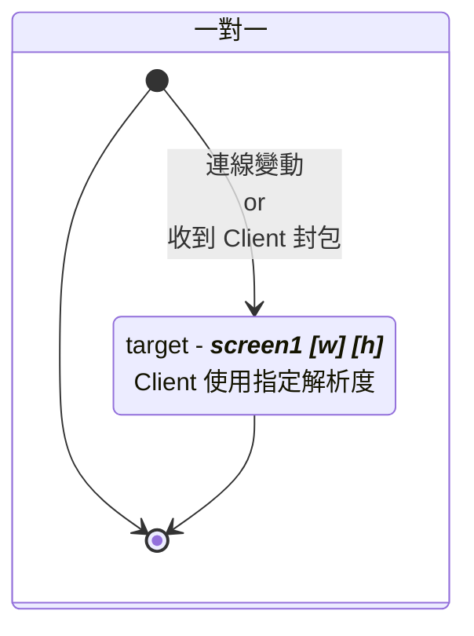
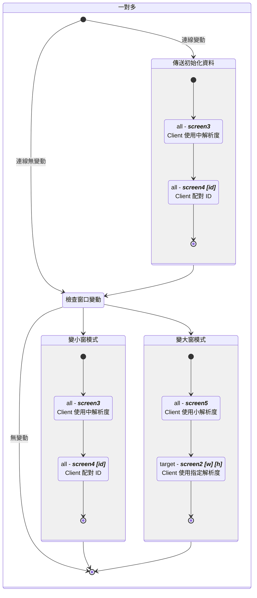

## 前情提要

 裡說到關於中控插件的事情，最近結案時被指出相關機能有問題，說是會閃屏與無法輸出畫面。

打從一開始，我就非常藐視這個中控軟體，為了解決畫面擷取就用了一大個黑盒子插件，重新封裝的源代碼也完全沒有進行版控（也許有，但如果有，也應該是提供 `git` 連結，而非打包好的 `unitypackage`）。

這篇就來說說到底經歷了甚麼 💩，怎麼火氣又上來了。



可能有人覺得是我故意要黑，把人家邏輯改醜了，但我沒那麼無聊。

事先聲明，_**底下的代碼除了調整縮排與刪除無關邏輯（更改 UI 等表現層部分），就是原始代碼的樣貌**_。

~~生結案報告這件事情也讓我很賭爛是另一回事。。。~~



## 架構

先談談誰是誰，實現傳輸畫面的機能，要拆兩半：

1. 中控插件 - `Client` 端，由 VR 教材開發者負責包進程式內
2. 中控軟體 - `Server` 端，是已經封裝好的執行檔

因為 `2` 是固定的，所以 `1`（我們）要配合 `2`（計畫方）。

架構是這樣的，所有的 VR 頭顯都是 `Client` 端，指向 `Server` 端的中控軟體（黑盒子插件有自動網路發現的功能），綁定正確的 `port` 就能傳輸。



黑盒子插件本身是透過 `UDP` 進行傳輸，可以先忽略掉包的問題，因為如果把掉包也考慮進來，這個中控軟體根本就不算穩定運作。



中控軟體有一對一、一對多兩個模式，但一對一模式並不代表最大連線數量為 `1`。

## 大意了沒有閃

計畫方提供的教學文件上指出，要把一個腳本放到場景中。

到這裡是我的問題，我沒有仔細看，該腳本是透過解析 `Server` 傳過來的封包，控制傳給 `Server` 畫面的解析度。

以下是解析封包與更改解析度的主要源碼：



> - `sendScreenW`、`sendScreenH` 為目標解析度，公開靜態變數，供後續使用
> - `ScreenWidth`、`ScreenHeight` 為螢幕的原解析度，私有變數（啟動後便不再更動，基本上是 `readonly`，但使用 `Unity` 生命週期不好實作唯讀）
> - `_string` 參數是經過黑盒子插件編碼後的字串



`screen` 可以對照後面 `Server` 的流程圖。



```csharp ResolutionController.cs
public void Action_ProcessStringData(string _string)
{
    string[] sData;

    sData = _string.Split(' ');
    if (sData[0] == "screen1")
    {
        if (int.Parse(sData[1]) > ScreenWidth)
        {
            sendScreenW = ScreenWidth;
        }
        else
        {
            sendScreenW = int.Parse(sData[1]);
        }

        if (int.Parse(sData[2]) > ScreenHeight)
        {
            sendScreenH = ScreenHeight;
        }
        else
        {
            sendScreenH = int.Parse(sData[2]);
        }
    }
    else if (sData[0] == "screen2")
    {
        if (int.Parse(sData[1]) > ScreenWidth)
        {
            sendScreenW = ScreenWidth;
        }
        else
        {
            sendScreenW = int.Parse(sData[1]);
        }

        if (int.Parse(sData[2]) > ScreenHeight)
        {
            sendScreenH = ScreenHeight;
        }
        else
        {
            sendScreenH = int.Parse(sData[2]);
        }
    }
    else if (sData[0] == "screen3")
    {
        sendScreenW = 512;
        sendScreenH = 288;
    }
    else if (sData[0] == "screen4")
    {
        pairLabel = int.Parse(sData[1]);
    }
    else if (sData[0] == "screen5")
    {
        sendScreenW = 100;
        sendScreenH = 58;
    }
    // else if (sData[0] == <other data>)
    // .
    // .
    // .
}
```



有的邏輯是相同的，但還是堅持要把條件寫進去。

至於為甚麼要調整解析度，主要是避免炸頻寬，當初我還沾沾自喜，想說用 `Graphic.Blit()` 的方式，解析度可好了，到頭來還是逃不過降解。



我也沒辦法測試極限情況，畢竟沒那麼多台裝置嘛，但計畫辦公室總有辦法的，我應該要相信他們測試過後的數值
🤘🥳🤘



另外可以細品更改解析度是怎麼實現的：



> - `rt` 是目標 `RenderTexture`，快取成員變數
> - `renderResolution` 是解析度，為 `Vector2` 成員變數（但像素不會有浮點，基本上會使用 `Vector2Int`），根據 `Server` 傳來的封包更改值

```csharp GameViewEncoder.cs
if (renderResolution.x <= 1) renderResolution.x = 1;
if (renderResolution.y <= 1) renderResolution.y = 1;

bool IsLinear = (ColorSpace == ColorSpace.Linear) && (CaptureMode == GameViewCaptureMode.FullScreen);

sourceDescriptor.width = Mathf.RoundToInt(renderResolution.x);
sourceDescriptor.height = Mathf.RoundToInt(renderResolution.y);
sourceDescriptor.sRGB = !IsLinear;

if (rt.width != sourceDescriptor.width ||
    rt.height != sourceDescriptor.height ||
    rt.sRGB != IsLinear)
{
    DestroyImmediate(rt);

    try { rt = new RenderTexture(sourceDescriptor); }
    catch
    {
        DestroyImmediate(rt);
        rt = new RenderTexture(sourceDescriptor.width, sourceDescriptor.height, 16, RenderTextureFormat.ARGB32);
    }
    rt.Create();
}
```



更改解析度時會 `Destroy` 並 `new()` 一個新的 `RenderTexture`，極端情況下頻繁銷毀建立物件，就怕 GC 搞你。



基本上，`RenderTexture` 是向 `GPU` 申請記憶體來操作，如果只是調整解析度，可以考慮使用 `RenderTexture.Release()` 以及 `RenderTexture.Create()` 來實現 `GPU` 上的記憶體釋放與建立。



## 代碼混淆界的翹楚

由於我實在搞不懂為啥一定要綁定溝通的腳本，所以我用 `UnityExplorer` 以及 `dnSpy` 還原了場景與源碼。

話先說在前面，我並不認識原作者，但我必須說，拉了一坨大的。

先來看看核心的邏輯腳本，當中的 `Update()` 方法：



> - `FMNetworkManager` 是黑盒子插件封裝出來的應用層
>   - `SendToTarget()` 傳送封包到指定 ip
>   - `SendToOther()` 傳送封包給所有連上的 `Client`

```csharp FMStatic.cs
private void Update()
{
    if (FMStatic.ServerOK)
    {
        if (FMStatic.screenW != Screen.width || FMStatic.screenH != Screen.height)
        {
            FMStatic.screenW = Screen.width;
            FMStatic.screenH = Screen.height;
            this.NowscreenH = FMStatic.screenH;
            this.NowscreeW = FMStatic.screenW;
            FMStatic.checkConnectionCase = 0;
            this.sendScreenCase = 0;
            this.NowConnectNum = FMStatic.connectCount;
        }
        if (this.NowConnectNum != FMStatic.connectCount && FMStatic.connectCount >= 1)
        {
            FMStatic.checkConnectionCase = 0;
            this.NowConnectNum = FMStatic.connectCount;
        }
        else if (this.NowConnectNum != FMStatic.connectCount && FMStatic.connectCount == 0)
        {
            this.NowConnectNum = FMStatic.connectCount;
        }
        if (FMStatic.caseNow == 0 && FMStatic.checkConnectionCase == 0)
        {
            FMStatic.checkConnectionCase = 1;
        }
        else if (FMStatic.caseNow == 1 && FMStatic.checkConnectionCase == 0 && this.Group3Case == 0)
        {
            FMNetworkManager.instance.SendToOthers("screen3");
            for (int i = 0; i < FMStatic.connectCount; i++)
            {
                this.sendTextScreen = "screen4 " + (1001 + i).ToString();
                string targetIP = FMStatic.connectIP[i];
                FMNetworkManager.instance.SendToTarget(this.sendTextScreen, targetIP);
            }
            FMStatic.checkConnectionCase = 1;
        }
        if (FMStatic.connectIP[0] != "" && this.sendScreenCase == 0 && FMStatic.caseNow == 0)
        {
            this.sendScreenCase = 1;
            this.sendTextScreen = "screen1 " + this.NowscreeW.ToString() + " " + this.NowscreenH.ToString();
            FMNetworkManager.instance.SendToTarget(this.sendTextScreen, FMStatic.connectIP[0]);
        }
        else if (FMStatic.connectIP[0] != "" && this.sendScreenCase == 4 && FMStatic.caseNow == 0)
        {
            this.sendScreenCase = 1;
            this.sendTextScreen = "screen1 " + this.NowscreeW.ToString() + " " + this.NowscreenH.ToString();
            FMNetworkManager.instance.SendToTarget(this.sendTextScreen, FMStatic.connectIP[0]);
        }
        else if (FMStatic.connectIP[0] != "" && this.sendScreenCase == 0 && this.Group3Case == 0 && FMStatic.caseNow == 1)
        {
            this.sendScreenCase = 1;
            FMNetworkManager.instance.SendToOthers("screen3");
            for (int j = 0; j < FMStatic.connectCount; j++)
            {
                this.sendTextScreen = "screen4 " + (1001 + j).ToString();
                string targetIP2 = FMStatic.connectIP[j];
                FMNetworkManager.instance.SendToTarget(this.sendTextScreen, targetIP2);
            }
        }
        else if (FMStatic.connectIP[0] != "" && this.sendScreenCase == 0 && this.Group3Case == 1 && FMStatic.caseNow == 1)
        {
            this.sendScreenCase = 1;
            this.sendTextScreen = "screen1 " + this.NowscreeW.ToString() + " " + this.NowscreenH.ToString();
            FMNetworkManager.instance.SendToTarget(this.sendTextScreen, FMStatic.destIP);
        }
        else if (FMStatic.connectIP[0] != "" && this.sendScreenCase == 5 && FMStatic.caseNow == 1)
        {
            this.sendScreenCase = 1;
            FMNetworkManager.instance.SendToOthers("screen5");
            this.sendTextScreen = "screen2 " + this.NowscreeW.ToString() + " " + this.NowscreenH.ToString();
            FMNetworkManager.instance.SendToTarget(this.sendTextScreen, FMStatic.destIP);
            this.sendTextScreen = "screen4 2001";
            FMNetworkManager.instance.SendToTarget(this.sendTextScreen, FMStatic.destIP);
        }
        // else if (warnCase)
        // .
        // .
        // .
    }
}
```



可以看得出來，作者想用幾個 State 變數來作流程判斷：

1. `caseNow`
2. `checkConnectionState`
3. `sendScreenCase`
4. `Group3Case`

跟前面一樣，乍看之下根本不知道這些邏輯在做啥。



由於是反編譯 `DLL`，`C#` 編譯為 `IL Code` 時會把 `Enum` 轉換成對應數值。所以開發時到底有沒有使用 `Enum` 來管理這些 `Magic Number` 是不可考的。



精簡過後，沒事，圖來了：

> 傳給 `Client` 的 `screen` 封包使用斜體標示：
> `all` = 傳給所有 `Client`
> `target` = 傳給目標 `Client`







這個流程圖可能給小學生用 `Scratch` 都能拉出來，更不用說原本的邏輯實現可能還有 bug 存在，完全沒經過重構，這就是想到啥寫啥的經典案例。



2025/08/20 更新：其實不是大中小解析度，那只是寫死的數值傳給 `Client` 端檢查用的。



## 歸納一下問題

可以先解說一下，解碼器是透過在封包開頭的 `id` 來決定是否要繼續解碼資料。

回到之前所說，一對一並不是最大連線數目為 1 的問題，就是因為這樣，所以多個用戶傳入的封包都被解碼並指定到 `Texture UI` 上，才導致閃屏。

由於黑盒子插件沒有提供最大連線數目的設定（儘管邏輯實現並不複雜），基本上應該要通知後續連入的 `Client`，`Server` 沒在理他，雖然單看 `Server` 端的程式碼，似乎沒有對這方面做對應。

至於一對多，有前面提到的 `screen4 [id]` 封包可以綁定，把該封包解密並將 `id` 指定到編碼器上，基本上就不會出現這個問題。

但是話又說回來，把接收到的封包傳給所有的解碼器，這本來就不是啥好作法，更不用說他將觸發綁在 `Unity` 場景上（`Persistant Event Call`）。


> 40 個小窗 + 1 個大窗，共 41 個事件綁定

好一點的作法應該是只使用一個解碼器，解碼完成後再透過 `Dictionary` 或是更單純的容器用 `Index` 找到需要被渲染的 `RawImage`，不就少了很多次的 `Convert`？



解碼轉換 `id` 使用 `BitConvert.ToInt32`，是 `.net` 提供的高級寫法，不過這種地方如果出現效能瓶頸，可以考慮 `shifting` 的方式。

```csharp Performance.cs
var arr = new byte[4];  // input bytes
var offset = 0;

int i1 = BitConvert.ToInt32(arr, offset);
int i2 = arr[offset + 0] << (0 * 8) |
         arr[offset + 1] << (1 * 8) |
         arr[offset + 2] << (2 * 8) |
         arr[offset + 3] << (3 * 8);
```



## 是黑盒子不代表不能改

關於傳輸，底層代碼沒那麼複雜，更不用說黑盒子插件還是直接使用 `.NET` 提供的 `UdpClient` 實現通訊。

除去閃屏問題後，能改的地方還是太多了，簡單列下面幾個：

1. 不要透過通知 `id` 來達成畫面配對，明明就有辦法取得 `IP`，用 `IP` 來決定用渲染到哪個 `UI Texture` 不香嗎
2. 在 `UDP` 環境，雙端都應該要定時 `Heartbeat`，才不會有意外發生
3. 寫 `C#` ，請善用非同步
4. 如果希望追求效能極致，減少 `Array` 的 `Copy`，使用 `Span` 或 `ReadonlySpan` 來做 `Event Callback` 比較好
5. 一對一模式根本就沒有禁止其他 `Client` 傳資料給 `Server`（由於直接使用廣播），導致不能有效降低頻寬使用
6. 對於 `Parse`、集合操作等等這些容易出例外的邏輯，都應該要捕捉例外，無論用 `TryParse` 或是直接寫 `try catch`

## 結論是啥

並不是說一定要寫狀態機，但全部的狀態都用 `if else condition` 來完成，不用 `switch case`，也沒有做任何方法封裝，純粹是給大家找麻煩而已。

另外，很多地方如果不想從外部呼叫方法，基本上都可以改用事件通知，但作者選擇放進 `Update()` 內用 `Flag` 逐幀判斷。

在撰寫程式碼時，基本上會在效能與可維護（可讀性）之間取捨，但從程式碼來看就是兩個都不要，既沒提升效能，也困難維護。

我常說寫程式要像搞藝術一樣慢慢雕，邏輯實現並不難，但要理解語言的特性並且活用語法糖；而 C# 作為一個先進的語言，反編譯了不少 `Unity` 遊戲，也是很久沒看到這種傷眼睛的東西了。



有的時候覺得很厲害，在大家還在思考如何做代碼混淆的時候，作者在撰寫時就同時完成了邏輯的混淆。


